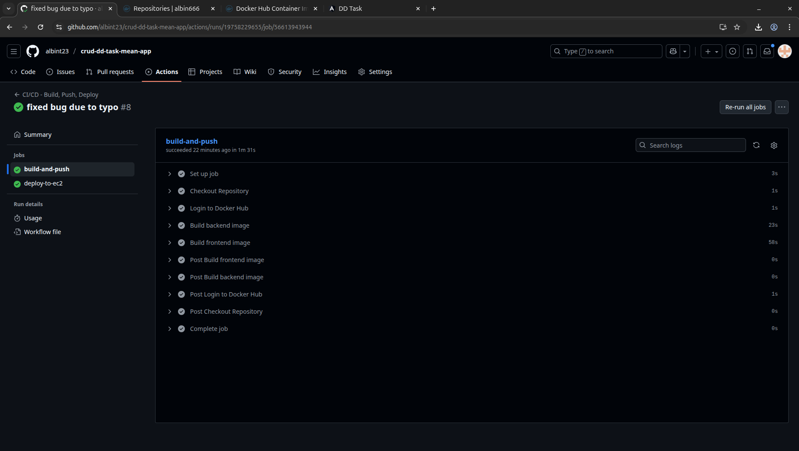
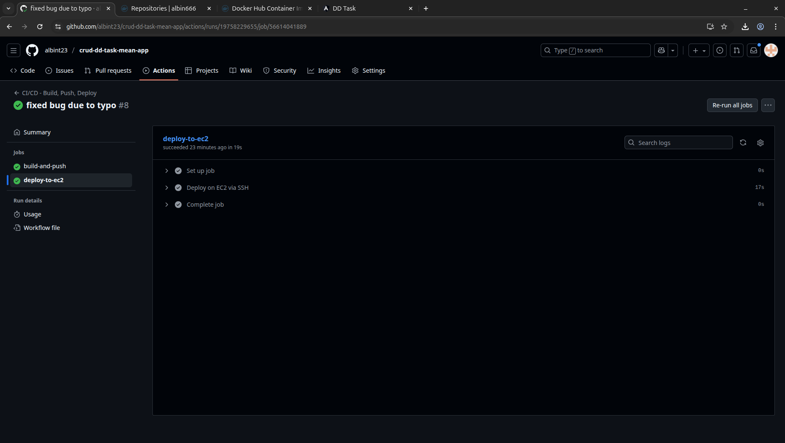
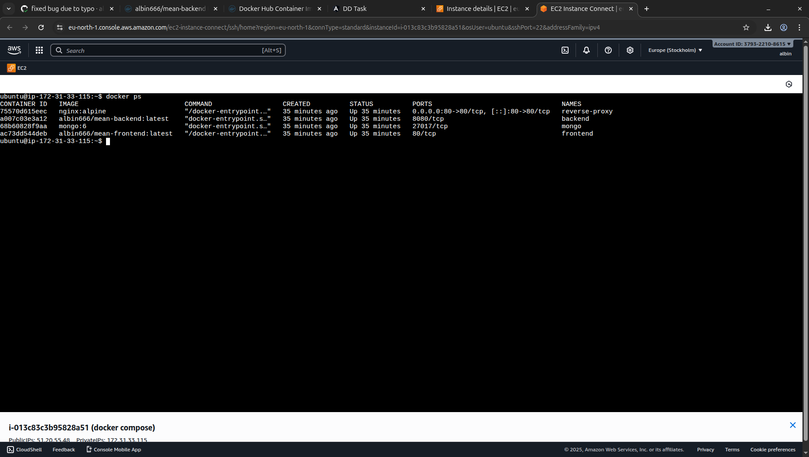
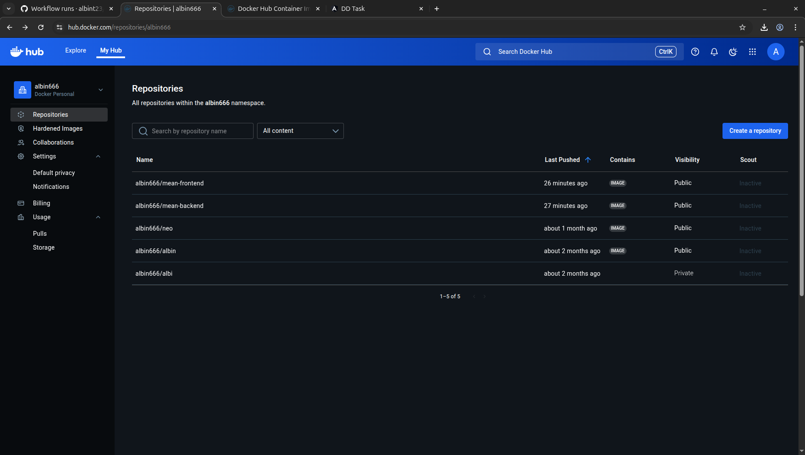
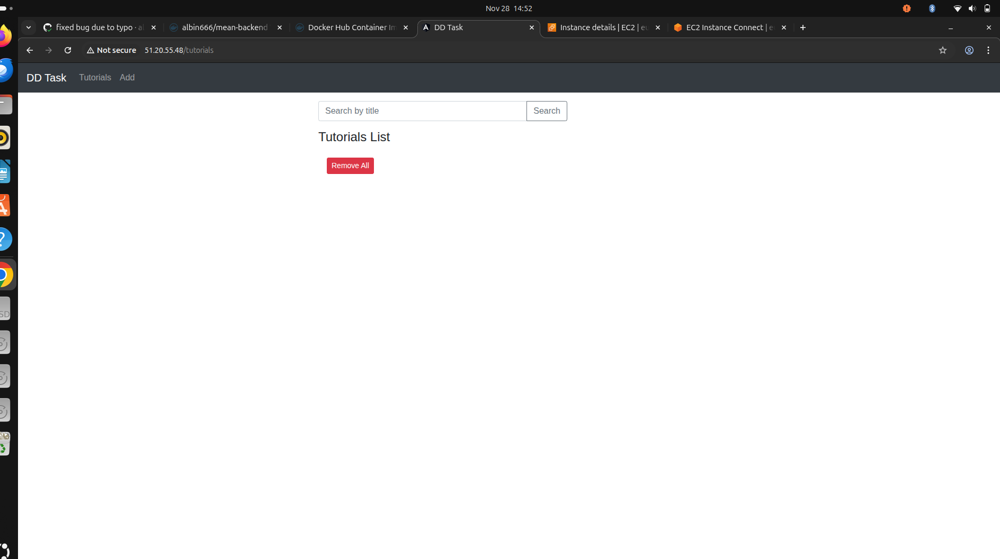
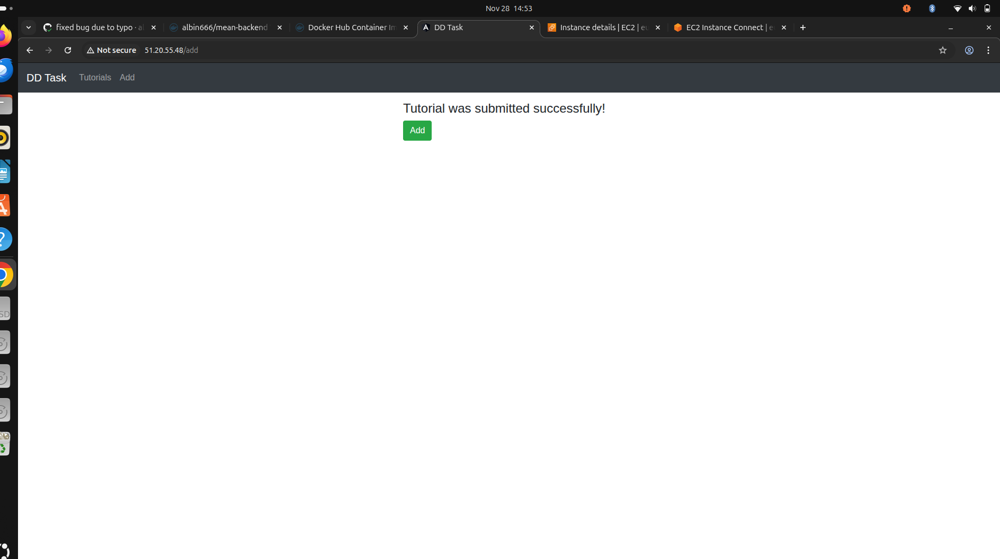
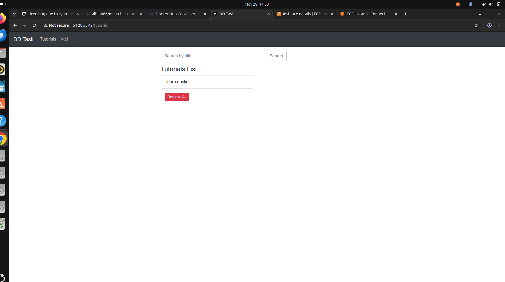
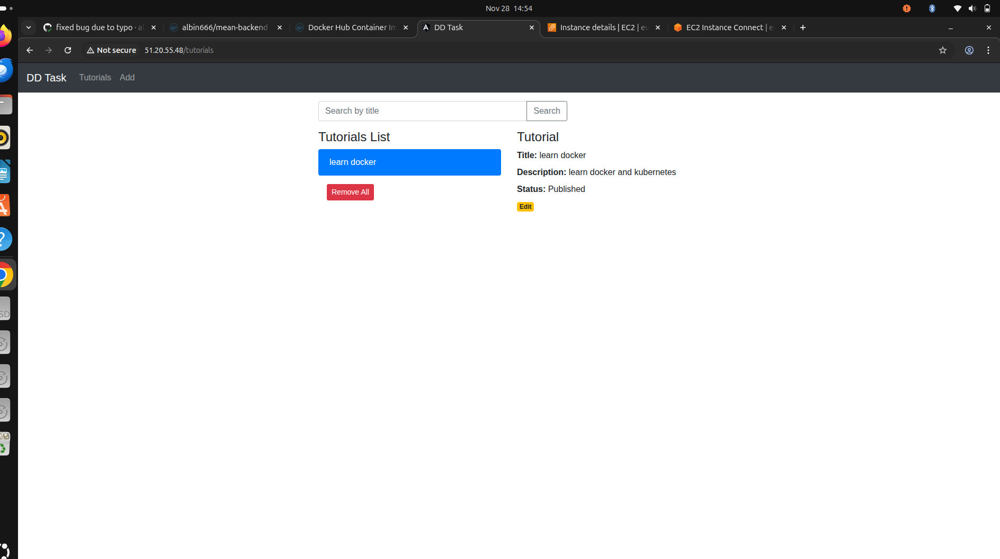

# 📌 Discover Dollar – DevOps Assignment

**MEAN Application | Docker | GitHub Actions CI/CD | Nginx Reverse Proxy | Cloud Deployment**

This repository contains the completed assignment for the **DevOps Engineer Intern** role at Discover Dollar.  
The objective was to containerize, deploy, automate, and document a full-stack MEAN application using Docker, GitHub Actions, Nginx, and an Ubuntu cloud VM.

---

# 🏗️ Architecture Overview

```
GitHub → GitHub Actions → Docker Hub → AWS EC2 → Docker Compose → Nginx → MEAN App
```

Components included:

- Angular Frontend (Dockerized + served via Nginx)  
- Node.js + Express Backend (Dockerized)  
- MongoDB (Docker-based)  
- Docker Compose (multi-service)  
- GitHub Actions CI/CD Pipeline  
- Nginx Reverse Proxy (inside container)  
- Ubuntu VM (AWS EC2 – 51.20.55.48)

---

# 🐳 1. Dockerfiles

Below are the exact Dockerfiles used in this project.

---

## 🔹 Frontend Dockerfile (`frontend/Dockerfile`)

```dockerfile
FROM node:18-alpine AS build
WORKDIR /app
COPY package*.json ./
RUN npm install
COPY . .
RUN npm run build --prod

# --- Stage 2: Nginx ---
FROM nginx:alpine
COPY nginx.conf /etc/nginx/conf.d/default.conf
COPY --from=build /app/dist/angular-15-crud /usr/share/nginx/html
EXPOSE 80
CMD ["nginx", "-g", "daemon off;"]
```

---

## 🔹 Backend Dockerfile (`backend/Dockerfile`)

```dockerfile
FROM node:18-alpine
WORKDIR /usr/src/app
COPY package*.json ./
RUN npm install
COPY . .
EXPOSE 8080
CMD ["node", "server.js"]
```

---

# 🧩 2. Docker Compose Setup

```yaml
version: "3.8"

services:
  reverse-proxy:
    image: nginx:alpine
    container_name: reverse-proxy
    restart: always
    ports:
      - "80:80"
    volumes:
      - ./nginx.conf:/etc/nginx/conf.d/default.conf
    depends_on:
      - frontend
      - backend

  frontend:
    image: albin666/mean-frontend:latest
    container_name: frontend
    restart: always

  backend:
    image: albin666/mean-backend:latest
    container_name: backend
    environment:
      - MONGO_URL=mongodb://mongo:27017/tutorials_db
    restart: always
    depends_on:
      - mongo

  mongo:
    image: mongo:6
    container_name: mongo
    restart: always
    volumes:
      - mongo_data:/data/db

volumes:
  mongo_data:
```

---

# 🌐 3. Nginx Reverse Proxy

**File:** `/nginx.conf`

```nginx
server {
    listen 80;

    # Proxy API calls to backend
    location /api/ {
        proxy_pass http://backend:8080/;
    }

    # Serve Angular app
    location / {
        try_files $uri $uri/ /index.html;
    }
}
```

### View Nginx Config (inside container)
```
docker exec -it frontend cat /etc/nginx/conf.d/default.conf
```

### Check Nginx Status
```
docker exec -it frontend ps aux
```

---

# 🤖 4. CI/CD – GitHub Actions

**File:** `.github/workflows/deploy.yml`

```yaml
name: CI/CD - Build, Push, Deploy

on:
  push:
    branches: ["main"]

jobs:

  # --------------------------
  # 1) BUILD AND PUSH IMAGES
  # --------------------------
  build-and-push:
    runs-on: ubuntu-latest

    steps:
      - name: Checkout Repository
        uses: actions/checkout@v4

      - name: Login to Docker Hub
        uses: docker/login-action@v3
        with:
          username: ${{ secrets.DOCKERHUB_USERNAME }}
          password: ${{ secrets.DOCKERHUB_TOKEN }}

      # Build & Push Backend
      - name: Build backend image
        uses: docker/build-push-action@v5
        with:
          context: ./backend
          file: ./backend/Dockerfile
          push: true
          tags: |
            ${{ secrets.DOCKERHUB_USERNAME }}/mean-backend:latest

      # Build & Push Frontend
      - name: Build frontend image
        uses: docker/build-push-action@v5
        with:
          context: ./frontend
          file: ./frontend/Dockerfile
          push: true
          tags: |
            ${{ secrets.DOCKERHUB_USERNAME }}/mean-frontend:latest

  # --------------------------
  # 2) DEPLOY ON EC2
  # --------------------------
  deploy-to-ec2:
    needs: build-and-push
    runs-on: ubuntu-latest

    steps:
      - name: Deploy on EC2 via SSH
        uses: appleboy/ssh-action@v1.1.0
        with:
          host: ${{ secrets.EC2_HOST }}
          username: ${{ secrets.EC2_USER }}
          key: ${{ secrets.EC2_KEY }}
          script: |
            echo "Checking Docker installation..."
            if ! command -v docker &> /dev/null
            then
              curl -fsSL https://get.docker.com | sudo sh
              sudo usermod -aG docker ubuntu
            fi

            echo "Using /home/ubuntu/app as deployment directory..."
            mkdir -p /home/ubuntu/app

            cd /home/ubuntu/app

            if [ ! -d .git ]; then
              echo "Cloning repository..."
              git clone https://github.com/${{ secrets.REPO_OWNER }}/${{ secrets.REPO_NAME }}.git .
            else
              echo "Pulling updates..."
              git pull origin main
            fi

            echo " Pulling new images from Docker Hub..."
            docker compose pull

            echo " Stopping old containers..."
            docker compose down

            echo " Starting updated containers..."
            docker compose up -d

            echo "Deployment completed! "
```

---

# 🌍 5. Application Access Details

| Service | URL |
|--------|------|
| **Frontend Application** | http://51.20.55.48 |
---

# 📸 6. Required Screenshots  
(All stored in the `/screenshots` folder)











---

# 🧠 7. Issues & Fixes

- Fixed Docker permission issue using `sudo usermod -aG docker $USER`  
- Angular build path adjusted to `dist/angular-15-crud`  
- Nginx routing corrected for `/api/`  
- GitHub Actions SSH deploy corrected  
- Docker networking fixed for MongoDB  

---

# 🎯 8. Final Result

The MEAN application is now:

- Fully containerized  
- Deployed on AWS EC2 using Docker Compose  
- Publicly accessible at **http://51.20.55.48**  
- Auto-updated through GitHub Actions  
- Reverse-proxied through Nginx (inside container)  
- Fully functional with backend API + MongoDB  

This completes the **Discover Dollar DevOps Assignment**.

